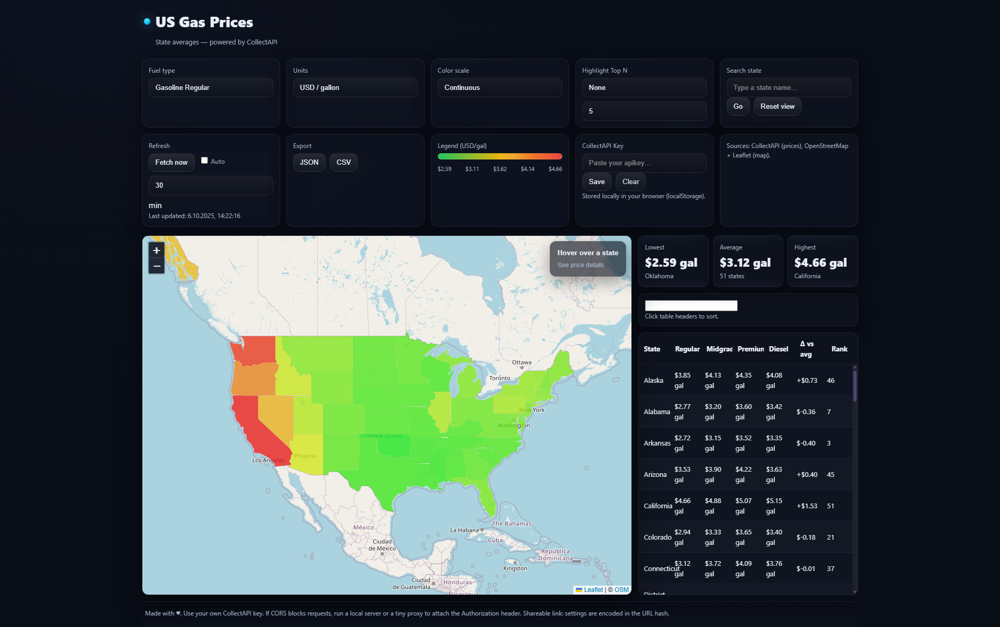

# US Gas Prices — Interactive Map 

A modern, responsive web app that visualizes average gas prices across US states on an interactive choropleth map. It uses Leaflet with OpenStreetMap tiles and the CollectAPI gasPrice/allUsaPrice endpoint. The UI includes analytics, rankings, export, search, and more.



## Features

- Interactive US states choropleth (Leaflet + OSM)
- Fuel types: Regular, Midgrade, Premium, Diesel
- Units: USD per gallon or USD per liter (live conversion)
- Color scales:
  - Continuous (green → red)
  - Quantiles (5 buckets)
- Highlight Top N cheapest/most expensive states
- Summary stats: min, average, max, with state labels
- Search: jump to a state and open its details
- Sortable, filterable table of all states
- Export current data to JSON or CSV (in the selected unit)
- Auto-refresh with configurable interval (stored locally)
- API key management in the UI (stored in localStorage)
- Shareable state via URL hash (permalinks to current settings)
- Modern, accessible, animated UI (focus states, reduced motion support)
- Fully responsive layout: map + sidebar on wide screens, stacked on small

## Demo

- Open index.html locally (see Quick start below)
- Optional screenshot: add your own at docs/screenshot.png and reference it here

## Tech stack

- Leaflet for mapping
- OpenStreetMap raster tiles
- CollectAPI gasPrice/allUsaPrice for price data
- Vanilla HTML/CSS/JS; no build step required

## Getting started

Prerequisites:
- A CollectAPI account and API key for the Gas Prices endpoint.
- Any simple static web server (recommended to avoid CORS/file:// issues).

Quick start:
1. Clone or download this repository.
2. Provide your CollectAPI key:
   - Preferred: paste it in the app UI (stored in localStorage), or
   - Quick local test: set API_KEY in script.js (not recommended for production).
3. Serve the folder locally:
   - Node: npx serve .
   - Python 3: python -m http.server 8080
4. Open http://localhost:PORT/index.html in your browser.

Production tip:
- Do not expose your key client-side. Use a tiny proxy (serverless function) that attaches the Authorization header and returns the API response to the browser.

## Configuration and controls
 
- Fuel type: Regular, Midgrade, Premium, Diesel.
- Units: USD/gal or USD/L (conversion: 1 gal = 3.785411784 L).
- Color scale: Continuous or Quantiles(5).
- Highlight: Top N cheapest or most expensive states.
- Search: type a state name and Go.
- Refresh: manual fetch; optional auto-refresh every X minutes (persisted).
- Export: download data as JSON or CSV in the selected unit.
- API key: paste in-field, Save; Clear removes it from localStorage.

## Data source and attribution

- Prices: CollectAPI — endpoint gasPrice/allUsaPrice (registration and API key required).
- Map tiles: © OpenStreetMap contributors. Ensure OSM attribution remains visible in the map.

## Security and privacy

- The in-browser API key option stores the key in localStorage on your device only.
- For public hosting, use a backend/proxy to keep keys server-side.
- No analytics or tracking are included by default.

## File structure

```
.
├── index.html
├── styles.css
└── script.js
```

- index.html: App layout and UI controls
- styles.css: Modern, animated, accessible styling
- script.js: Map, API calls, state management, analytics, and UI bindings

## Troubleshooting

- CORS or network errors:
  - Serve via a local server (avoid file://).
  - If CollectAPI blocks requests or you want to hide your key, use a proxy.
- Blank map or “Failed to fetch US states GeoJSON”:
  - Check internet connectivity or CORS/network policy.
- No data:
  - Verify your CollectAPI key and that your plan includes gasPrice/allUsaPrice.

## Contributing

- Issues and PRs are welcome. Please keep changes small and focused.
- For UI/UX tweaks, ensure accessibility (focus visible, color contrast) and mobile responsiveness.

## Roadmap ideas

- Light theme toggle
- Time series (historical trends) and sparklines per state
- Additional color scales and custom ranges
- Pin/compare selected states
- Print/PDF export of current view

---
Built with Leaflet, OpenStreetMap tiles, and CollectAPI.
